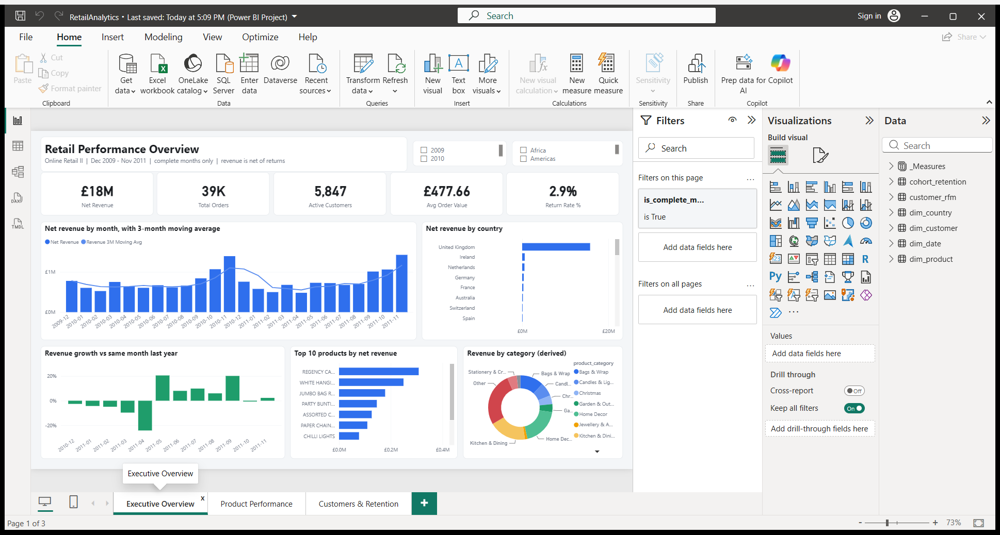
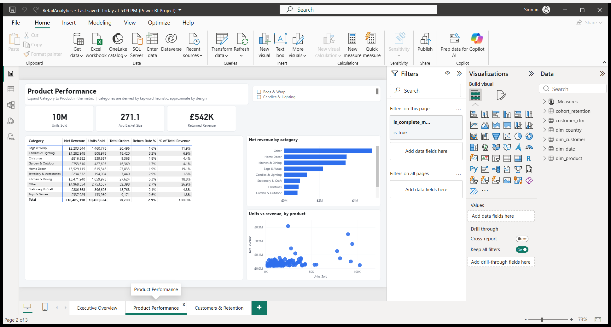
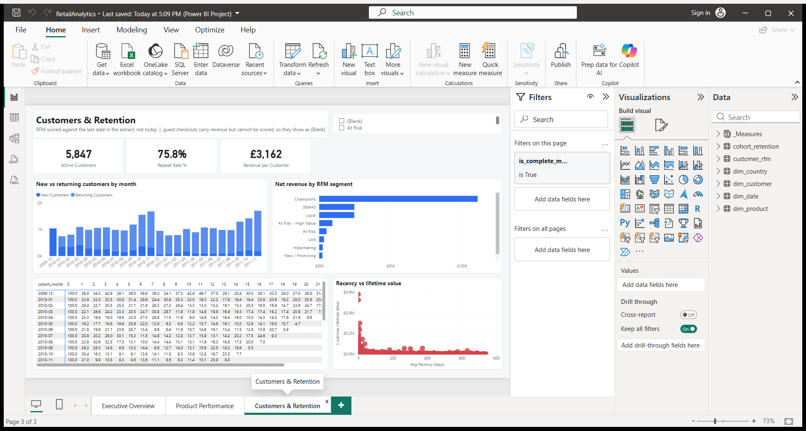
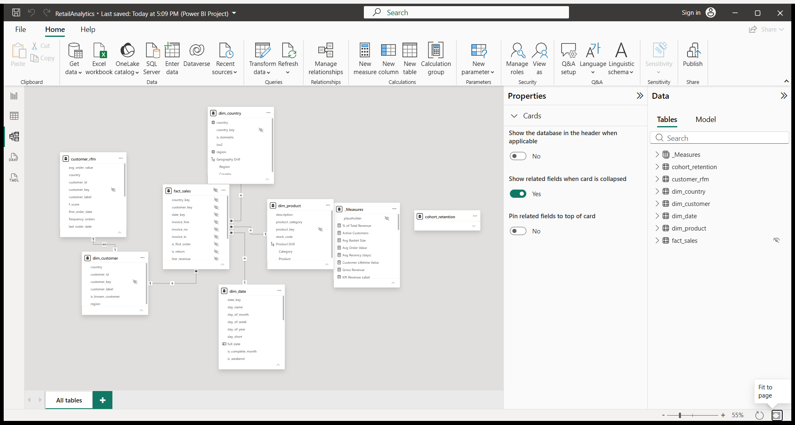

# Retail Analytics — PostgreSQL → Power BI

An end-to-end analytics build on the **UCI Online Retail II** dataset:
1.07M transaction lines loaded into PostgreSQL, modelled as a star schema,
exposed through analysis views, and presented as a three-page Power BI report
with DAX time-intelligence measures.

The emphasis is on the parts that separate a working dashboard from a correct
one — every headline number is cross-checked against the warehouse in
[`docs/validation.md`](docs/validation.md).



**Built from 1,067,371 source rows → 1,021,126 fact rows**, every excluded row
accounted for by a named reason. 11/11 data-quality assertions pass.

| | |
|---|---:|
| Net revenue | £18,485,318 |
| Orders | 38,700 |
| Active customers | 5,847 |
| Average order value | £477.66 |
| Return rate | 2.85% |
| Repeat purchase rate | 75.8% |

*(complete months only — see [the partial-month trap](#2-the-extract-stops-mid-month))*

---

## What's here

```
sql/          numbered, re-runnable pipeline: schema → load → star → views → assertions
etl/          dataset download, Excel→CSV flattening, one-command pipeline runner
powerbi/      PBIP project: TMDL semantic model + PBIR report definition
dax/          every measure, with the reasoning behind it
docs/         data dictionary, validation results, screenshots
tools/        scripts that generated the report definition (see tools/README.md)
```

## Quick start

Requires PostgreSQL 14+ and Power BI Desktop.

```bash
git clone <this-repo> && cd retail-analytics-dashboard
```

Store your Postgres credentials the standard way — the repo never contains a
password:

```bash
mkdir -p "$APPDATA/postgresql" && printf 'localhost:5432:*:postgres:YOUR_PASSWORD\n' > "$APPDATA/postgresql/pgpass.conf"
```

Then build the warehouse:

```bash
pwsh ./etl/run_pipeline.ps1
```

That downloads the dataset (~43 MB), flattens it to CSV, creates the database,
loads 1.07M rows, builds the star schema and views, and runs the data-quality
assertions. Finally, open `powerbi/RetailAnalytics.pbip` in Power BI Desktop
and refresh.

---

## Architecture

```
Excel workbook (2 sheets)
        │  etl/prepare_csv.py  — flatten only, no cleaning
        ▼
staging.online_retail_raw          permissive types, no constraints
        │  sql/03, sql/04          — every business rule lives here
        ▼
core.dim_date  dim_product  dim_customer  dim_country
core.fact_sales                    invoice-line grain
        │  sql/06
        ▼
analytics.vw_*                     the only schema Power BI touches
        │
        ▼
Power BI  ·  star schema import  ·  DAX measures
```

**Cleaning happens in SQL, not in Python or Power Query.** The Python step does
Excel→CSV and nothing else. Every business rule is a reviewable SQL statement
with a comment explaining why it exists, rather than a click-path buried in the
Power Query editor.

**Power BI reads only `analytics`.** The `core` tables can be reshaped without
breaking the report as long as the view signatures hold.

---

## The parts that matter

Most of the work in this project went into four problems that are easy to miss
and produce a dashboard that looks fine and reports the wrong number.

### 1. The two sheets overlap by nine days

`Year 2009-2010` runs to 2010-12-09. `Year 2010-2011` starts at 2010-12-01.
Load both naively and December 2010 carries an extra week of trading — which
then corrupts every 2011 year-over-year comparison.

De-duplication is by natural key across both sheets
(`sql/04_transform_facts.sql`), and `sql/07_data_quality.sql` asserts that no
duplicate natural key survives. **34,337 rows** are collapsed this way.

### 2. The extract stops mid-month

The last transaction is **2011-12-09**. December 2011 has nine trading days;
December 2010 has thirty-one. Compared directly, the dashboard reports a
catastrophic collapse that never happened.

Unfiltered, December 2011 reports **−41.9% YoY**. Nothing happened — it is nine
days measured against thirty-one.

`dim_date.is_complete_month` flags this and every report page filters on it.
For the cases where the partial month is deliberately shown, the
`[Revenue YoY % (Like-for-Like)]` measure clips the prior year to the same
day-of-month so nine days compare against nine days.

### 3. A fifth of the rows have no customer

Rather than dropping them or leaving NULL foreign keys, they map to a reserved
**Guest / Unknown** member at `customer_key = -1` — 226,965 fact rows carrying
£2,567,652. Their revenue stays in the headline numbers; `[Active Customers]`
explicitly excludes the synthetic member so it isn't counted as one very large
customer. On the RFM page they surface honestly as `(Blank)`, since a customer
who cannot be identified across time cannot be scored.

### 4. Nothing disappears silently

`core.fact_sales_exclusions` is a reconciliation ledger. Every staging row is
either in the fact table or counted there under a named reason. The assertion
suite fails the build if the arithmetic doesn't close:

```
1,021,126  fact_sales
   34,337  duplicate_row        sheet overlap + exact repeats
    5,980  service_line         postage, discounts, bank charges, test rows
    5,928  non_positive_price   giveaways, bad-debt write-offs
─────────
1,067,371  staging rows         = the source row count
```

---

## Data-quality assertions

`sql/07_data_quality.sql` builds `analytics.vw_data_quality` and then raises an
exception if any check fails, so a broken build stops instead of publishing.

| Check | Guards against |
|---|---|
| staging = fact + exclusions | Rows vanishing unnoticed |
| No duplicate invoice lines | The nine-day sheet overlap |
| `dim_date` contiguous | Time intelligence returning blank |
| Month series dense | `LAG(…, 12)` not meaning "same month last year" |
| `line_revenue = quantity × unit_price` | Derived-measure drift |
| No service lines in the fact | Postage counted as product revenue |
| Guest member exists and carries revenue | Unattributed revenue being dropped |
| No NULLs in measures or keys | |
| Return rate within 0–25% | Sign-convention flips, double-counted returns |
| No orphan dimension keys | |
| ≥ 2 calendar years present | YoY being impossible |

---

## SQL techniques used

Window functions (`LAG`, `ROW_NUMBER`, `RANK`, `NTILE`, running `SUM`,
framed moving averages), `DISTINCT ON`, `FILTER` aggregates, lateral-free
correlated logic, CTEs, `generate_series` date spines, partial indexes,
`\gexec` for idempotent DDL, and `DO` blocks for assertions.

Analysis views include **ABC/Pareto classification**, **RFM segmentation**, and
a **cohort retention triangle** — see `sql/06_analysis_views.sql`.

Two findings that fall out of them: 1,038 SKUs (22% of the catalogue) generate
80% of revenue, and 1,302 "Champions" — 22% of scored customers — account for
68% of attributable revenue, with a further 253 high-value accounts sitting in
the At Risk band.

---

## The report

Three pages, all filtered to complete months.

**Executive Overview** — five KPI cards (net revenue, orders, active customers,
average order value, return rate), monthly revenue with its 3-month moving
average, YoY growth by month, revenue by country, top 10 products, category mix.

**Product Performance** — a Category → Product matrix with expand-to-drill,
revenue by category, and a units-vs-revenue scatter that separates
high-volume/low-value lines from the opposite.



**Customers & Retention** — new vs returning by month, revenue by RFM segment,
a cohort retention triangle, and a recency-vs-lifetime-value scatter.



The star schema, as loaded:



### Why PBIP instead of a bare .pbix

The report is committed as a **Power BI Project** — TMDL for the semantic model
and PBIR JSON for the report. Both are text, so measures and layout changes show
up as readable diffs instead of a binary blob. The `.pbix` is produced by opening
`RetailAnalytics.pbip` in Power BI Desktop and saving.

### DAX

All measures are documented in [`dax/measures.md`](dax/measures.md) with the
reasoning behind each. The non-obvious ones:

- `[Revenue YoY]` guards against BLANK so the first year doesn't show a fake +100%
- `[Revenue 3M Moving Avg]` iterates `year_month`, not dates — iterating dates
  returns an average *daily* figure ~30× too small
- `[Revenue 7D Moving Avg]` coerces BLANK to zero, because this retailer doesn't
  trade Saturdays and `AVERAGEX` would otherwise divide by 6 instead of 7
- `[% of Total Revenue]` uses `REMOVEFILTERS` on specific dimensions so the
  denominator still respects the date slicer

Several measures deliberately duplicate a SQL view. That redundancy is the test
— see [`docs/validation.md`](docs/validation.md).

---

## Dataset

**UCI Online Retail II**, CC BY 4.0 —
[archive.ics.uci.edu/dataset/502](https://archive.ics.uci.edu/dataset/502/online+retail+ii).
Real transactions from a UK-based online gift retailer, 2009-12-01 to
2011-12-09. Full column reference in [`docs/data-dictionary.md`](docs/data-dictionary.md).
